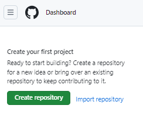
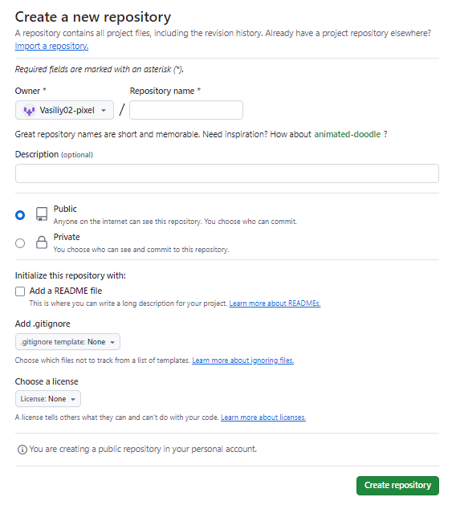
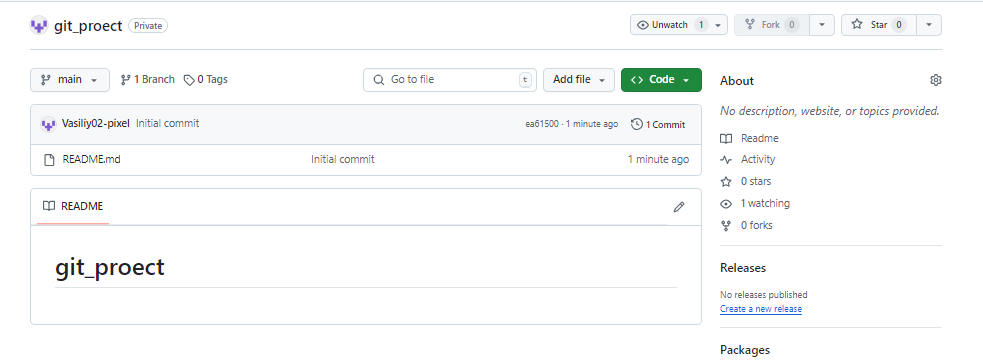

### Создание аккаунта на GitHub
1. Перейдите по [ссылке github.com](https://github.com/). 
2. Зарегистрируйте свою учетную запись. Введите в поле адрес своей электронной почты и нажмите кнопку **Sign up for GitHub**.
             
3. Проверьте свою почту с прошлого шага, придумайте и введите пароль, введите имя вашего профиля, выберите страну и нажмите кнопку **Continue**.
4. Пройдите проверку на капчу.
5. Получите письмо с кодом на почту и введите его на следующей странице.
6. Введите свои учетные данные. Нажмите кнопку **Sign in**.

### Создание удаленного репозитория на GitHub

1. Нажмите кнопку **Create repository**.

   

   Откроется страница создания репозитория *Create a new repository*.

   

2.   Заполните:
   
     2.1. Поле **Repository name** – имя репозитория, которое будет отображаться на странице аккаунта. 
     
     2.2. Поле **Description** – описание репозитория.
     
     2.3. Радиобаттон **Public** (открытый тип репозитория, доступный всем пользователям GitHub) или **Private** (закрытый тип репозитория, доступный только вам и людям, которым вы предоставите доступ).
     
     2.4. Чекбокс напротив *README файла*, с которым будете работать.

2. Нажмите кнопку **Create repository**.

   Откроется страница созданного репозитория.

   

