В рамках проекта все участники процесса клонируют один проект с главной веткой *main*. Однако каждый работает в своей *n-ветке*, созданной отдельно от ветки *main*. После отправки изменений в удаленный репозиторий (команда `git push -u origin <vetka>`) принято подтягивать содержимое *n-ветки* в ветку *main* (см. подраздел [Запрос на принятие изменений (pull request)](#zapros_na_prinyatie_izmenenij_pull_request)), а затем сливать данные изменения (см. подраздел [Запрос на слияние веток (merge pull request)](#zapros_na_sliyanie_vetok_merge_pull_request)). 

Исполнитель по задаче создает **pull request**, а лид — сливает изменения **merge pull request**, проверяя отсутствие конфликтов (см. подраздел [Конфликты при слиянии веток](#konflikty_pri_sliyanii_vetok)).

<h3 id="zapros_na_prinyatie_izmenenij_pull_request">Запрос на принятие изменений (pull request)</h3>

Существует два способа запроса на принятие изменений из *n-ветки* в *main*.

**Первый способ**: с помощью желтого уведомления от GitHub.

 

1. Нажимите кнопку **Compare & pull request**.

   Откроется страница **Open a pull request**.  
   
2. Заполните поле **Add a title** и **Add a description**, нажмите кнопку **Create pull request**.

    

**Второй способ**: 

1. Откройте раздел **Pull requests** в панеле навигации на GitHub.
2. Нажмите кнопку **New pull request**.
3. Выберите в поле **base** — *main*, **compare** — ветку, которую хотите мерджить.

     

4. Нажмите кнопку **Create pull request**.

<h3 id="zapros_na_sliyanie_vetok_merge_pull_request">Запрос на слияние веток (merge pull request)</h3>

1. Перейдите в раздел **Pull requests**.
2. Выберите из списка нужный **pull request**.
  
   Откроется cтраница слияния веток. 

   

3. Проверьте отсутствие конфликтов (см. подраздел [Конфликты при слиянии веток](#konflikty_pri_sliyanii_vetok)). Если конфликтов нет, нажмите кнопку **Merge pull request**.
4. Подтвердите слияние веток с помощью кнопки **Confirm merdge**.

   Откроется страница с уведомлением о слиянии веток.

   

5. При необходимости заполните блок с комментарием **Add a comment** и нажмите кнопку **Comment**.

<h3 id="konflikty_pri_sliyanii_vetok">Конфликты при слиянии веток</h3>

<h4 id="o_konfliktah">О конфликтах</h4>

Конфликты возникают при слиянии веток, где имеются конкурирующие фиксации в файлах. Git не понимает какие изменения следует включать в окончательное слияние, поэтому конфликты решаются вручную исполнителем задачи. До решения конфликта кнопка **Merge pull reguest** недоступна.

*Причины появления конфликтов*:

1. Исполнитель перешел в ветку, в которой были опубликованы новые изменения, не подтянул изменения командой `git pull` (см. подраздел [Правка инструкции по другому проекту в новой ветке](/primery/files/razdel_6_szenarii_raboty_s_git/)), внес изменения в файле и опубликовал.

2. Двое исполнителей, работая в одной или двух разных ветках, вносят разные изменения в одну строку одного файла.  

> Если исполнители будут работать в одной ветке, но в разных строках файлов, и подтягивать изменения друг друга командой `git pull` перед окончательной публикацией (см. подраздел [Правка инструкции с коллегой в одной ветке](/primery/files/razdel_6_szenarii_raboty_s_git/)), то конфликтов не возникнет.
>

3. Один исполнитель редактирует файл, а другой — удаляет этот же файл. 

Отследить конфликт проще всего в VS Code с помощью вкладки *Source Control Graph*. Если на графе отображается более двух ответвлений от первой линии, то при слиянии возникнет конфликт.

 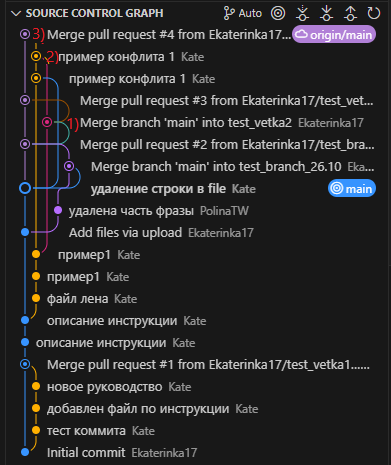

К примеру, на рисунке выше отмечен момент создания конфликта (1), момент решения конфликта (2) и слияния с веткой *main* (3).

<h4 id="reshenie_konfliktov_sliania">Решение конфликтов слияния</h4>

**Первый способ**: если конфликт слияния вызван конкурирующими изменениями строк, например при внесении разных изменений в одну строку одного файла в разных ветках репозитория Git, то его _**решают на GitHub с помощью редактора конфликтов**_.

1. Перейдите в раздел **Pull requests** на GitHub (см. шаг 3 подраздела [Запрос на слияние веток (merge pull request)](#zapros_na_sliyanie_vetok_merge_pull_request)).

   Откроется страница с уведомлением о конфликте.

   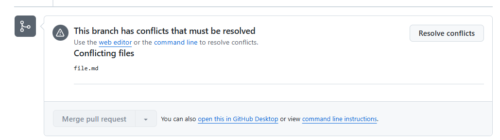

2. Нажмите на кнопку **Resolve conflicts**.

   Откроется редактор конфликтов.

   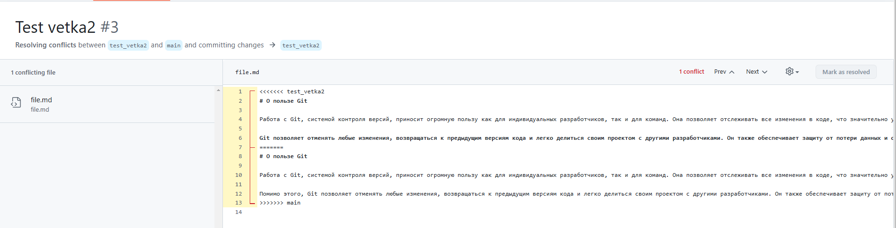

   Для данного файла в ветке *main* строке 6 было выполнено одно изменение, а в ветке *test_vetka2* строке 12 — другое. Поэтому срока 6 выделена жирным.

   Для решения конфликта достаточно выбрать между строкой 6 и 12, оставив нужную, а повторяющиеся предложения удалить.

3. Выделите ненужные строки и удалите их. Например, с 7-13.

   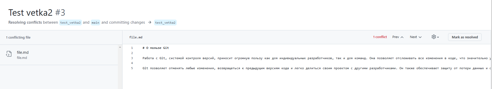

4. Нажмите на кнопку **Mark as resolved**.
   
   Если конфликт устранен, то напротив файла отобразится зеленная галочка.

   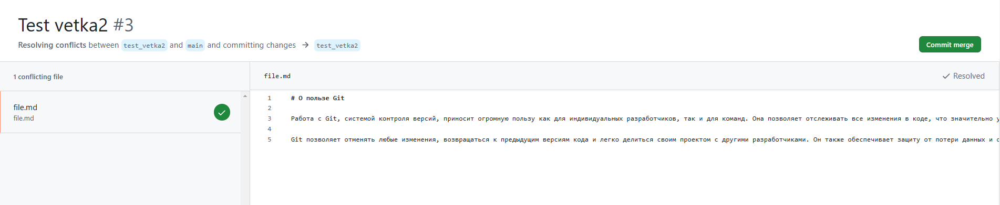

5. Нажмите на кнопку **Commit merge**.

   Откроется cтраница слияния веток.

   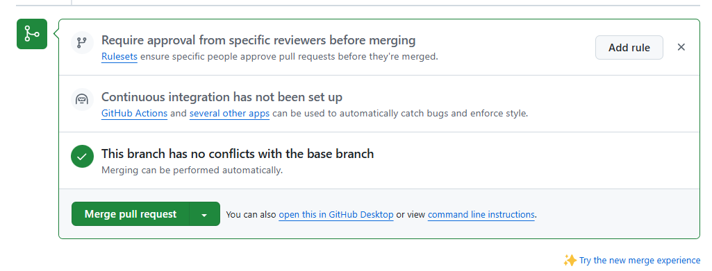

6. Выполните шаги 3-4 подраздела [Запрос на слияние веток (merge pull request)](#zapros_na_sliyanie_vetok_merge_pull_request).

**Второй способ**: остальные типы конфликтов слияния _**решают в локальном репозитории (рекомендуемый способ) с помощью IDE VS Code**_ и отправляют изменения в ветку на GitHub.
   
1. Откройте проект в VS Code.

2. Откройте конфликтный файл. Помечается в проекте восклицательным знаком.

   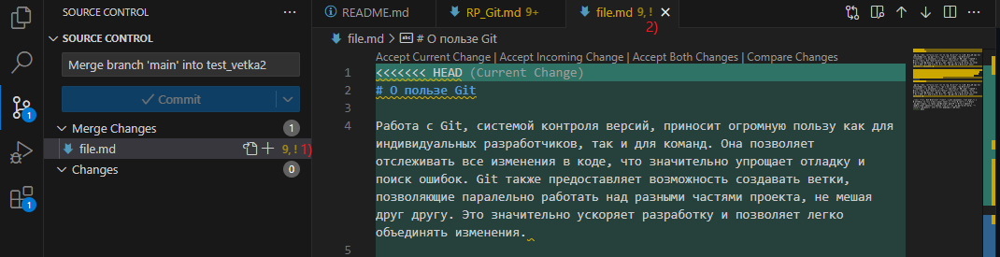

   Конфликтные изменения выделены красным цветом в зеленом и синем блоке.

   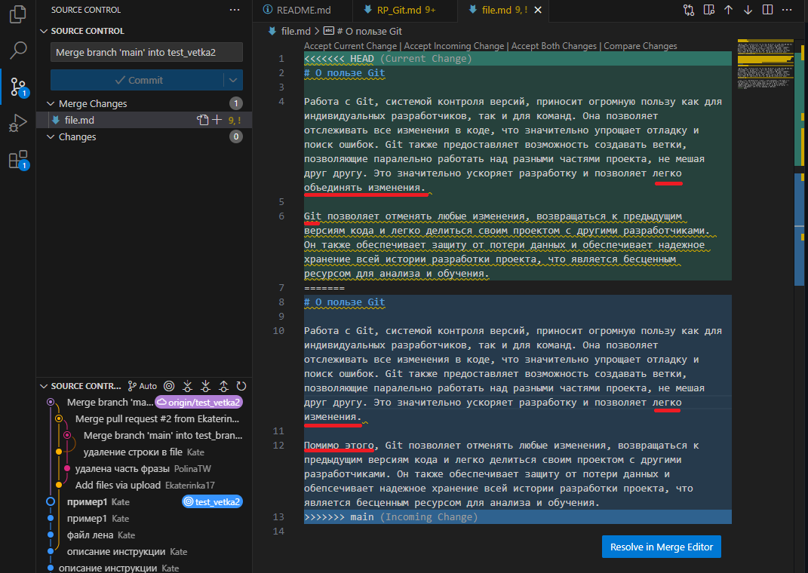

3. Нажмите на кнопку **Resolve in Merge Editor**.

   Откроется _Merging: file.md_ и предварительный просмотр решения конфликта в блоке _Result file. md_.

   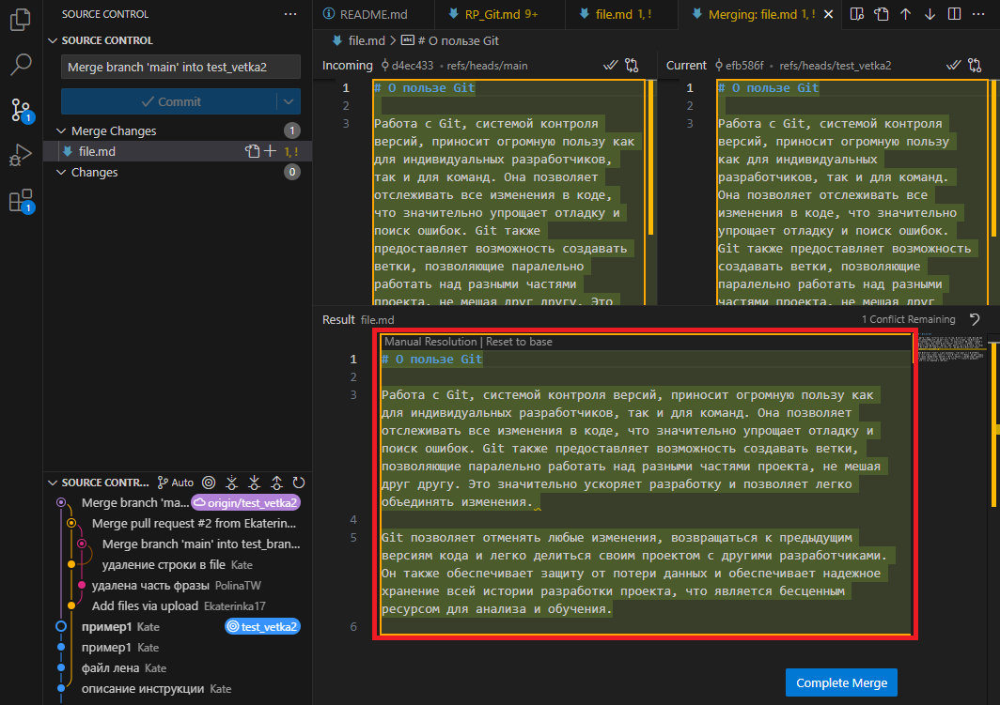

4. Нажмите на кнопку **Complete Merge**.

   Откроется модальное окно подтверждения слияния.

   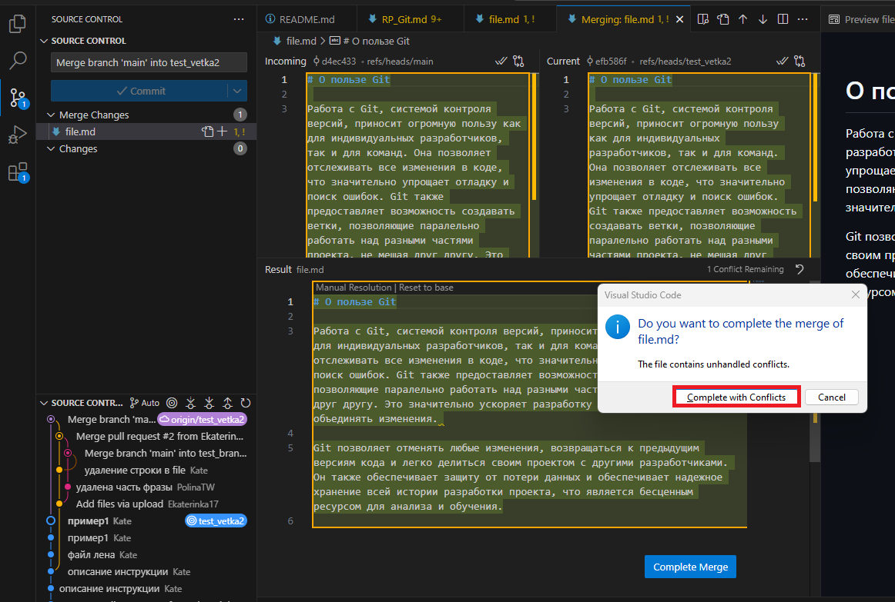

5. Нажмите на кнопку **Complete with Conflicts**.

   Закроется _Merging: file.md_, в файле _file. md_ отобразятся принятые изменения, восклицательный знак исчезнет.

   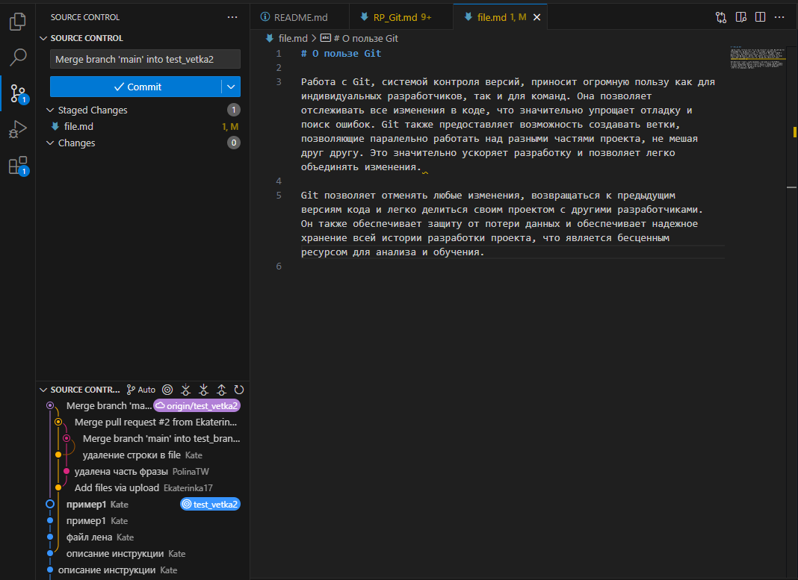

6. Выполните заново все шаги подраздела [Запрос на принятие изменений (pull request)](#zapros_na_prinyatie_izmenenij_pull_request) и [Запрос на слияние веток (merge pull request)](#zapros_na_sliyanie_vetok_merge_pull_request), старый **pull request** удалите. 

