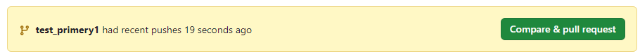
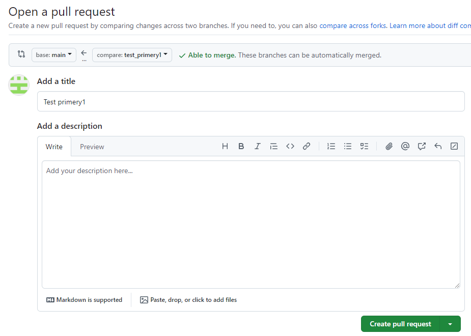
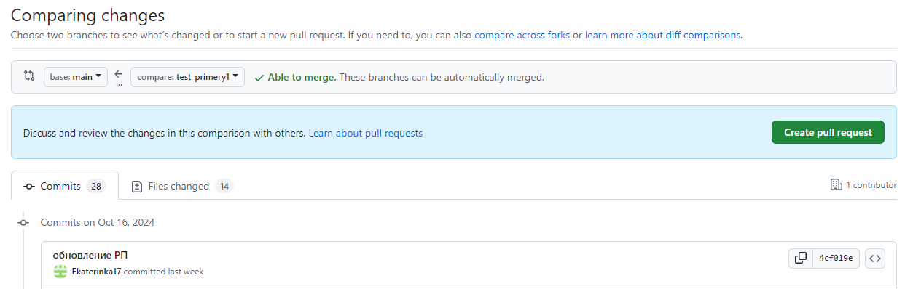
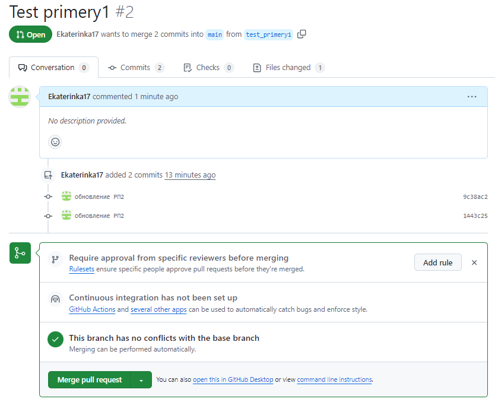
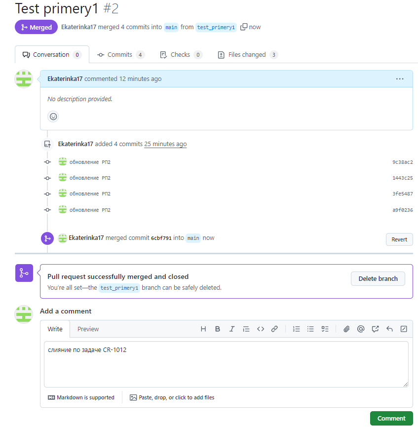

В рамках проекта все участники процесса клонируют один проект с главной веткой *main*. Но каждый работает в своей *n-ветке*, созданной от ветки *main*. После отправки изменений в удаленный репозиторий (команда `git push -u origin <vetka>`) принято:

1. Подтягивать содержимое *n-ветки* в ветку *main* (см. подраздел [Запрос на принятие изменений (pull request)](#zapros_na_prinyatie_izmenenij_pull_request)).
2. Сливать изменения (см. подраздел [Запрос на слияние веток (merge pull request)](#zapros_na_sliyanie_vetok_merge_pull_request)). 

Исполнитель по задаче создает **pull request**, а Лид — сливает изменения **merge pull request**, проверяя отсутствие конфликтов (см. подраздел [Конфликты при слиянии веток](/primery/files/razdel_6_konflikty_pri_slianii_vetok/)).

<h3 id="zapros_na_prinyatie_izmenenij_pull_request">Запрос на принятие изменений (pull request)</h3>

Существует два способа запроса на принятие изменений из *n-ветки* в *main*.

**Первый способ**: с помощью желтого уведомления от GitHub.

 

1. Нажмите кнопку **Compare & pull request**.

   Откроется страница **Open a pull request**.  
   
2. Заполните поле **Add a title** и **Add a description**, нажмите кнопку **Create pull request**.

    

**Второй способ**: 

1. Откройте раздел **Pull requests** в панеле навигации на GitHub.
2. Нажмите кнопку **New pull request**.
3. Выберите в поле **base** — *main*, **compare** — ветку, которую хотите мерджить.

     

4. Нажмите кнопку **Create pull request**.

<h3 id="zapros_na_sliyanie_vetok_merge_pull_request">Запрос на слияние веток (merge pull request)</h3>

1. Перейдите в раздел **Pull requests**.
2. Выберите из списка нужный **pull request**.
  
   Откроется cтраница слияния веток. 

   

3. Проверьте отсутствие конфликтов (см. подраздел [Конфликты при слиянии веток](/primery/files/razdel_6_konflikty_pri_slianii_vetok/)). Если конфликтов нет, то нажмите кнопку **Merge pull request**.
4. Подтвердите слияние веток с помощью кнопки **Confirm merdge**.

   Откроется страница с уведомлением о слиянии веток.

   

5. Заполните блок с комментарием **Add a comment** при необходимости и нажмите кнопку **Comment**.

