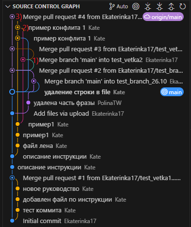
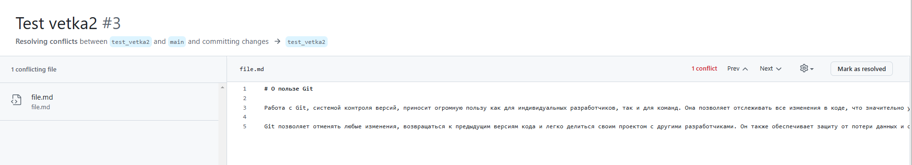
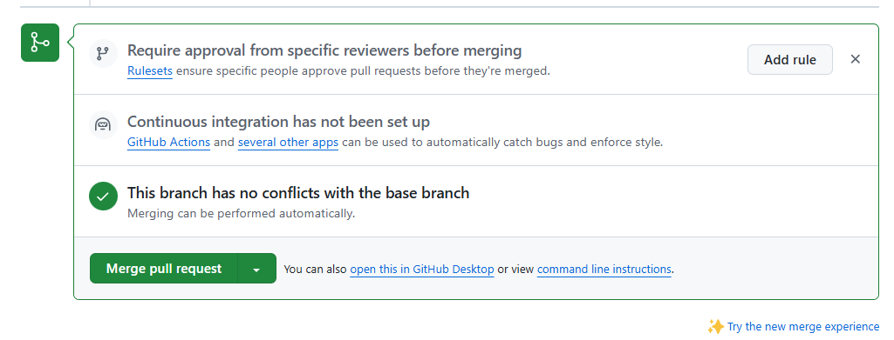
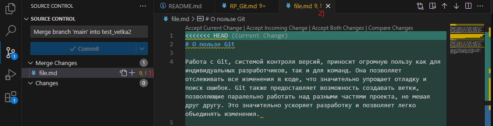
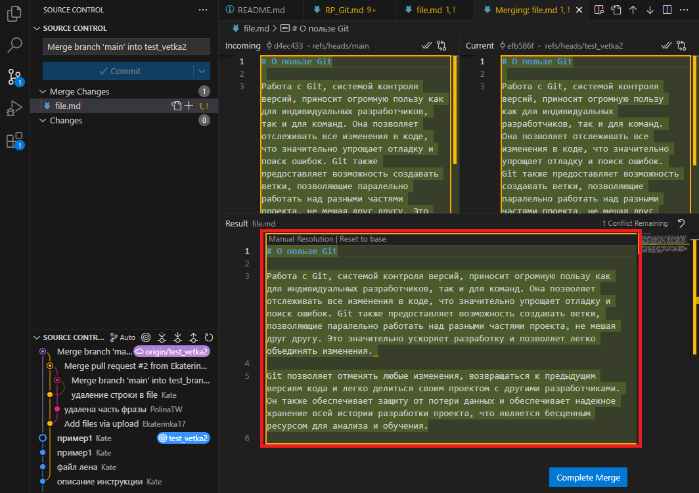
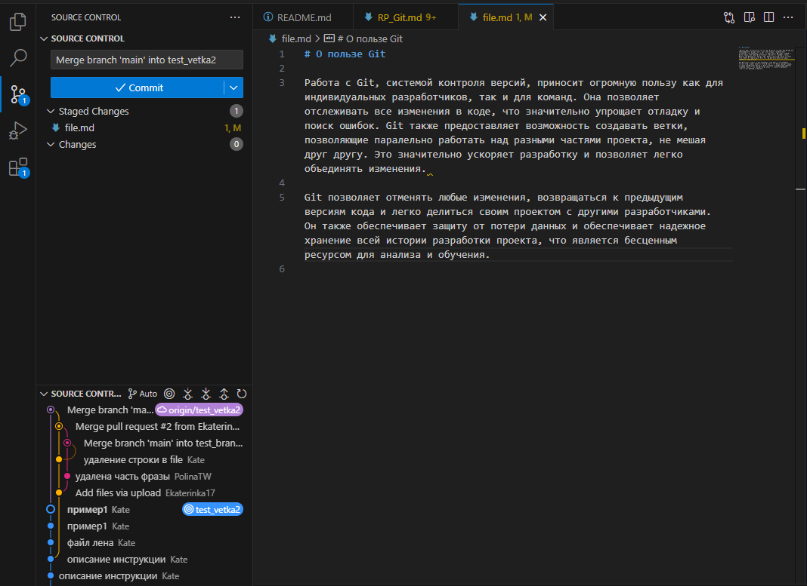

<h3 id="o_konfliktah">О конфликтах</h3>

Конфликты возникают при слиянии веток, где имеются конкурирующие фиксации в файлах. Git не понимает какие изменения следует включать в окончательное слияние, поэтому конфликты решаются вручную исполнителем задачи. До решения конфликта кнопка **Merge pull reguest** недоступна.

*Причины появления конфликтов*:

1. Исполнитель перешел в ветку, в которой были опубликованы новые изменения, не подтянул изменения командой `git pull` (см. подраздел [Правка инструкции по другому проекту в новой ветке](/primery/files/razdel_7_szenarii_raboty_s_git/)), внес изменения в файле и опубликовал.

2. Двое исполнителей, работая в одной или двух разных ветках, вносят разные изменения в одну строку одного файла.  

> Если исполнители будут работать в одной ветке, но в разных строках файлов, и подтягивать изменения друг друга командой `git pull` перед окончательной публикацией (см. подраздел [Правка инструкции с другим исполнителем в одной ветке](/primery/files/razdel_7_szenarii_raboty_s_git/)), то конфликтов не возникнет.
>

3. Один исполнитель редактирует файл, а другой — удаляет этот же файл. 

*Мониторинг конфликтов*

Отследить конфликт проще всего в VS Code с помощью вкладки *Source Control Graph*. Если на графе отображается больше двух ответвлений от первой линии, то при слиянии возникнет конфликт.

 

К примеру, на рис. выше отмечен момент создания конфликта (1), момент решения конфликта (2) и слияния с веткой *main* (3).

<h3 id="reshenie_konfliktov_sliania">Решение конфликтов слияния</h3>

**Первый способ**: если конфликт слияния вызван конкурирующими изменениями строк, например при внесении разных изменений в одну строку одного файла в разных ветках репозитория Git, то его _**решают на GitHub с помощью редактора конфликтов**_.

1. Перейдите в раздел **Pull requests** на GitHub (см. шаг 3 подраздела [Запрос на слияние веток (merge pull request)](/primery/files/razdel_5_rabota_s_udalenym_repozitoriem/)).

   Откроется страница с уведомлением о конфликте.

   

2. Нажмите кнопку **Resolve conflicts**.

   Откроется редактор конфликтов.

   

   Для данного файла в ветке *main* строке 6 было выполнено одно изменение, а в ветке *test_vetka2* строке 12 — другое. Поэтому срока 6 выделена жирным.

3. Просмотрите изменения между строкой 1 и 13.

4. Выделите ненужные строки и удалите их, например, с 7-13. 

   Или удаляются выборочные предложения между блоками, скобочки <<<<<<< >>>>>>> и значки =======.

   

5. Нажмите кнопку **Mark as resolved**.
   
   Если конфликт устранен, то напротив файла отобразится зеленная галочка.

   

6. Нажмите кнопку **Commit merge**.

   Откроется cтраница слияния веток.

   

7. Выполните шаги 3-4 подраздела [Запрос на слияние веток (merge pull request)](/primery/files/razdel_5_rabota_s_udalenym_repozitoriem/).

**Второй способ**: остальные типы конфликтов слияния _**решают в локальном репозитории с помощью VS Code**_ и отправляют изменения в ветку на GitHub.

> Применим в компаниях, где над проектом работает много Исполнителей. 
>
   
1. Откройте проект в приложении VS Code.

2. Откройте конфликтный файл. Помечается в проекте восклицательным знаком.

   

   Конфликтная часть находится между скобочками <<<<<<< >>>>>>>. В зеленом блоке отображаются изменения из ветки *test_vetka2*, которая является текущей веткой репозитория. В синем блоке отображаются изменения из ветки *main*, т.е. ветка в которую сливаются изменения из ветки *test_vetka2*.

   Конкурирующие изменения в строках подчеркнуты красным цветом в зеленом и синем блоке.

   

3. Выберите изменения между зеленым и синим блоком, либо объедините их любым удобным способом, скобочки <<<<<<< >>>>>>> и значки ======= уберите.

   Если на данном шаге не будут выбраны нужные изменения, то при нажатии на кнопку **Resolve in Merge Editor** в редакторе слияния автоматически отобразятся изменения только из зеленого блока. 

4. Нажмите кнопку **Resolve in Merge Editor**.

   Откроется _Merging: file.md_ или редактор слияния. В блоке _Result_ отобразится предварительный просмотр решения конфликта.

   

5. Проверьте блок _Result_, внесите окончательные правки перед слиянием.

6. Нажмите кнопку **Complete Merge**.

   Откроется модальное окно подтверждения слияния.

7. Нажмите кнопку **Complete with Conflicts**.

   Закроется _Merging: file.md_, в файле _file. md_ отобразятся принятые изменения.

   

8. Перейдите в приложение Git Bash и выполните последовательно команды:

   8.1. `git add .`.
   
   8.2. `git commit -m "merge branch"`.

   8.3. `git push -u origin test_vetka2`.

9. Выполните заново все шаги подраздела [Запрос на принятие изменений (pull request)](/primery/files/razdel_5_rabota_s_udalenym_repozitoriem/) и [Запрос на слияние веток (merge pull request)](/primery/files/razdel_5_rabota_s_udalenym_repozitoriem/). 

**Третий способ**: универсальный алгоритм решения конфликтов.

1. Перейдите в ветку *main*.

2. Загрузите новые изменения с помощью команды `git pull`.

3. Вернитесь в свою ветку.

4. Выполните команду `git merge main` и разрешите конфликт локально (см. шаг 2 **второго способа** решения конфликтов). 
   
   Создастся локальный коммит слияния.

5. Выполните шаги 8-9 **второго способа** решения конфликтов.
