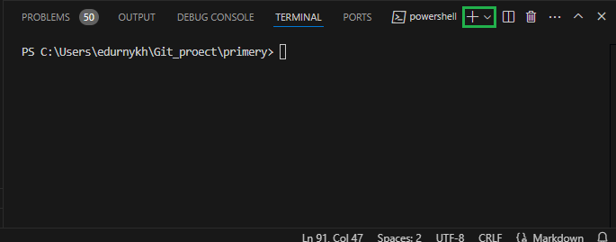
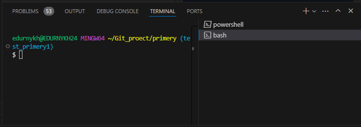
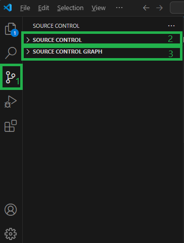
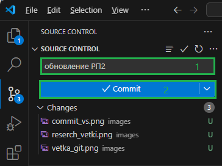
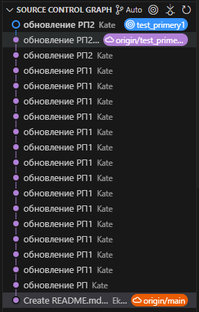

Для работы с локальным репозиторием можно использовать родную командную оболочку Windows — PowerShell или установленную — Git Bash. Однако работать проще, если видишь весь проект целиком. Поэтому в рамках настоящей инструкции рассмотрим работу с Git в приложении VS Code.

## Работа в терминале Git Bash через VS Code

1. Откройте терминал в VS Code c помощью верхнего меню **Terminal**→**New Terminal**.

По умолчанию откроется терминал *PowerShell*. 

2. Переключитесь на терминал *Git Bash*. Для этого нажмите на значок стрелочки, показанный на рисунке ниже, и выберите пункт **Git Bash**.

Терминал *Git Bash* открыт.

Описание команд, выполняемых в терминале *Git Bash*, для работы с локальным репозиторием см. в подразделе [Команды Git для работы в терминале](/primery/files/razdel_4_rabota_s_lokalnum_repozitoriem/) инструкции [Руководство по Git](/primery). В подразделе **Работа c Git через интерфейс VS Code** показаны альтернативные команды Git, которые можно выполнять с помощью функционала VS Code.

## Работа c Git через интерфейс VS Code

Для работы с ветками в VS Code предусмотрена панель в левом нижнем углу приложения. В зеленой рамке со стрелочками отображается значок синхронизации. При нажатии на значок и подтверждении операции загружаются изменения из одноименной ветки удаленного репозитория (аналог команды `git pull` в терминале Git Bash).

   <figure>
    
    <figcaption align="center">Нижняя панель для работы с ветками</figcaption>
    </figure>

В зеленой рамке с текстом *test_primery1* отображается наименование ветки, в которой работает исполнитель в настоящий момент, находясь в локальном репозитории. 

При нажатии на данное наименование в строке поиска отобразятся команды для создания новой ветки (1) и команды для перехода к другой существующей ветке (2).

Для создания новой ветки от текущей локальной ветки выберите команду *Create new branch* и введите наименование ветки (аналог команды `git checkout -b <имя_ветки>`). Чтобы создать новую ветку от другой ветки (не текущей), выберите команду *Create new branch from*, нажмите на нужную ветку из списка и введите наименование новой ветки (аналог команд `git checkout <имя_ветки_от_которой_будет_создана_новая>`, `git branch <имя_новой_ветки>`). 

Для перехода к другой существующей ветке выберите нужную из списка на рисунке выше (аналог команды `git checkout <имя_ветки>`). 

Для работы с индексом и коммитами в VS Code предусмотрен раздел **Source Control** (1), после открытия которого отображаются вкладки *Source Control* (2) и *Source Control Graph* (3).

На вкладке *Source Control* отображаются файлы с изменениями, которые можно добавлять в индекс и коммитить. Для этого заполняется поле комментарием (1) и нажимается кнопка **Commit** (2) (описанные действия аналоги команд `git add .` и `git commit -m "коммит"` в терминале Git Bash).

После создания коммита на вкладке отобразится кнопка **Sync Changes**, предназначенная для отправки файлов в удаленный репозиторий (аналог команды `git push -u origin <название_ветки>` в терминале Git Bash).

На вкладке *Source Control Graph* можно отслеживать на каком коммите находится удаленная и локальная ветки.
- Синее облачко показывает коммит в локальном репозитории.
- Фиолетовое облачко показывает коммит в удаленном репозитории.
- Оранжевое облачко показывает главную ветку, старт создания проекта. Или выделяет главную ветку "не main", если относительно нее были созданы новые ветки. 

 

С помощью данного графа можно отслеживать и просматривать изменения в файлах. Для этого выбирается нужный коммит в графе, после чего открывается файл с изменениями. К примеру, в коммите "обновление РП2" красным выделены удаленные элементы в файле, а зеленым - добавленные.

 

